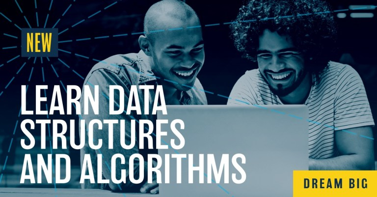

# Data Structures & Algorithms
In this course you will learn data structures and algorithms by solving 80+ practice problems. You will begin each course by learning to solve defined problems related to a particular data structure and algorithm. By the end of each course, you would be able to evaluate and assess different data structures and algorithms for any open-ended problem and implement a solution based on your design choices.

## Program Details
### Welcome
Get an overview of your program. Meet your instructors, and refresh your Python skills. Learn the framework to deconstruct any open-ended problem and then understand the concepts of time and space complexity.

    **Project 1: Unscramble Computer Science Problems**
    Deconstruct a series of open-ended problems into smaller components (e.g, inputs, outputs, series of functions).
### Data Structures
Learn different data structures that can be used to store data. Implement different methods used to manipulate these data structures and examine the efficiency. Understand the advantages and applications of different data structures. Learn how to approach open ended problems (either in interview or real-world) and select appropriate data structures based on requirements.

    ** Project 2: Show Me the Data Structures**
    Solve a series of open-ended practice problems such as LRU Cache Private Blockchain, File Recursion and many more. Hone your skills to identify and implement appropriate data structures and corresponding methods which meet given constraints

### Basic Algorithms
Learn and implement basic algorithms such as searching and sorting on different data structures and examine the efficiency of these algorithms. Use recursion to implement these algorithms and then learn how some of these algorithms can be implemented without recursion. Practice selecting and modifying these algorithms for a variety of interview problems.
   
    **Project 3: ​Problems vs. Algorithms**
    A series of real-world open ended problems such as request routing for web server, search-term auto-completion and Fibonacci heap which train you to apply suitable data structures and algorithms under different context.

### Advanced Algorithms
Build on your algorithm skills by learning more advanced algorithms such as brute-force greedy algorithms, graph algorithms, and dynamic programming which optimizes recursion by storing results to sub problems.

    **Project 4: ​Route Planner**
    In this project, you will build a route-planning algorithm like the one used in Google Maps to calculate the shortest path between two points on a map. You will first select and implement appropriate data-structure to represent points on a map and then implement the A* algorithm to find shortest path.